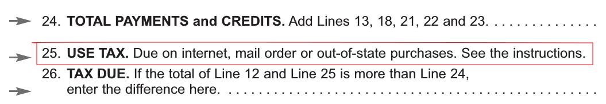
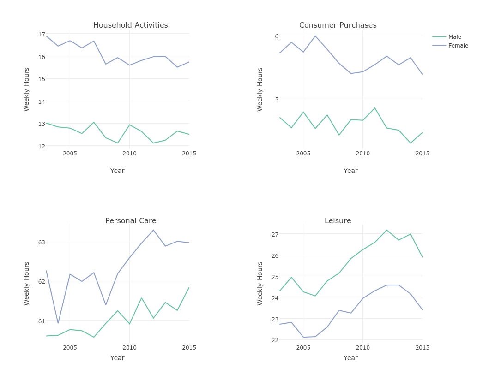
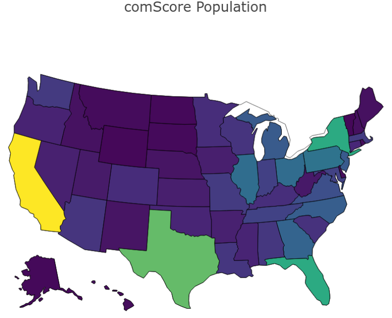
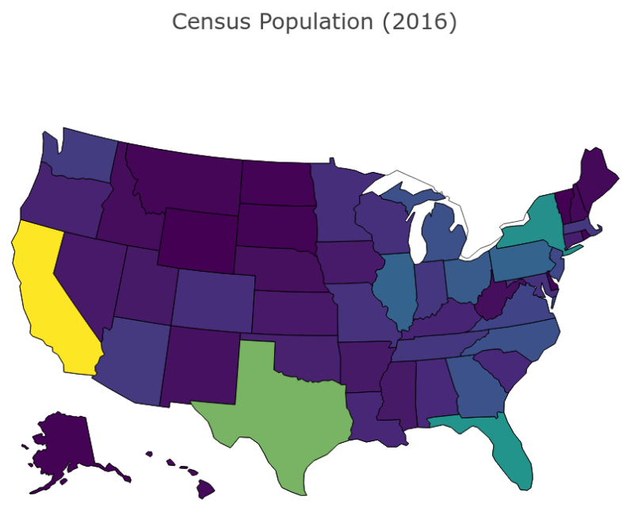
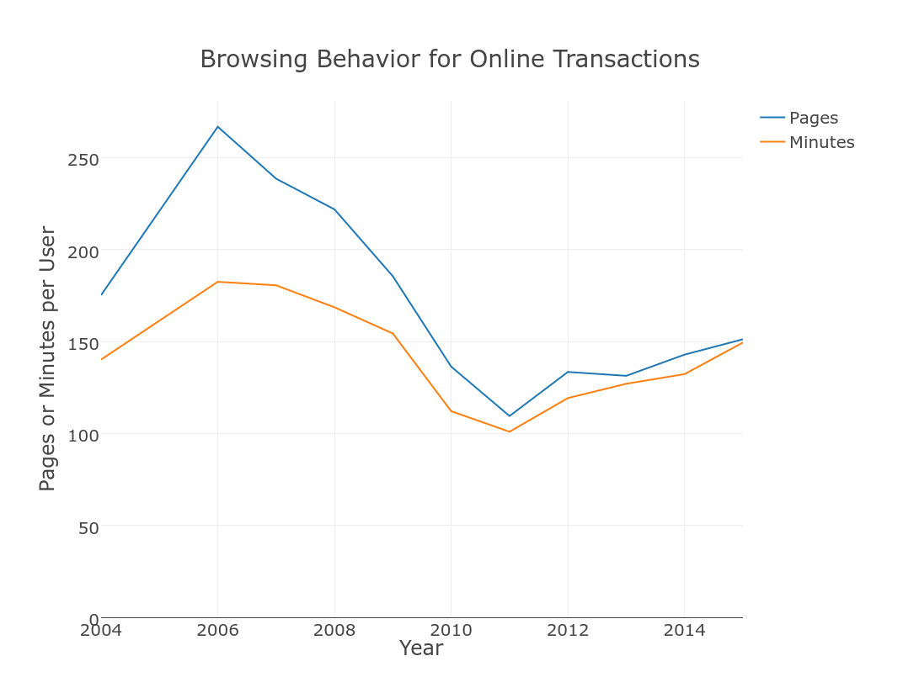
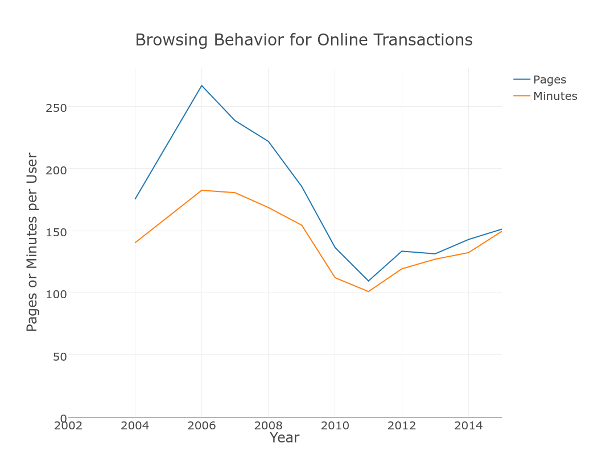

### Background
* Online shopping has grown substantially over the past few decades 

### Implications
>* **Economic:** Online shopping is a growing share of consumption

\medskip

>* **Policy:** Most online shopping is untaxed
>       + Use online shopping data to estimate tax responsiveness

\medskip

>* **Time Use:** Understand how individuals use time when online
>       + Use online shopping data to estimate how individuals value time

### Research Question
* What does online shopping data reveal about price and time elasticities? 
    + How much of the growth in online shopping is attributable to lower prices (e.g. lower search costs, low/no sales tax)?
    + How much is due to the increased time savings?

### Policy Implications
* Potentially large negative impacts on state finances
    + States cannot compel out-of-state vendors to collect sales taxes
    + States rely on **use taxes** which consumers must self-report
    
\medskip

* Price/tax-sensitive consumers would respond to lower sales tax 

\medskip

* Time-sensitive consumers would respond to increased enforcement

### PA Tax Form

### Time-Use Implications
* Through online shopping individuals can more finely choose their time-money preferences

\medskip

* Historically, there was a lower bound on time allocated to shopping
    + This lower bound is rapidly approaching zero
    
\centering
\includegraphics[width = 0.7\textwidth]{dash.png}

### Related Literature
* **Online Shopping and Taxes**
    + Goolsbee (2000), Alm (2005), Ballard (2007), Scanlan (2007), Goolsbee et al (2010), and Einav et al (2014) all find that online shopping decisions are sensitive to sales taxes
* **Online Shopping and Search**
    + Koulayev (2009), Kim et al (2010), and de Los Santos et al (2012) use online data to evaluate search models
* **Time Use**
    + Becker (1965), Ghez and Becker (1975), Benhabib et al (1991), and Greenwood and Hercowitz (1991) develop the theory of how households allocate time
    + Rupert et al (1995), Aguiar and Hurst (2007), Gelber and Mitchell (2009), Nevo and Wong (2015), McGrattan et al (1997), Chang and Schorfheide (2003), and Karabarbounis (2011) estimate the elasticity of substitution between market and home goods

### Time Trends

\centering

### comScore Web Behavior Data
* ATUS does not provide enough granularity to parse out how people trade off time and money

\medskip

* comScore Web Behavior database has information on online shopping and browsing activity of about 50,000 households going back to 2002
    + **Transaction data: **Website, price, quantity, basket total, product category, product description, and time
    + **Browsing data: **Website, pages viewed, browsing duration, and time
    + **Demographic data: **Household size, income, children, connection speed, ZIP code, head of household's education, age, and race
        * Similar demographics to CPS demographic profile of internet users
        
### Demographic Summary

+--------------------+---------------+--------------------+--------------+
|                    | 25%           | Median             | 75%          |
+====================+===============+====================+==============+
| **Household Size** | 2             | 3                  | 4            |
+--------------------+---------------+--------------------+--------------+
| **Age**            | 35-39         | 45-49              | 55-59        |
+--------------------+---------------+--------------------+--------------+
| **Income**         | 25k-35k       | 35k-50k            | 75k-100k     |
+--------------------+---------------+--------------------+--------------+

+--------------------+---------------+
|                    | Mean          |
+====================+===============+
| **Child Present**  | 0.60          |
+--------------------+---------------+
| **Hispanic**       | 0.15          |
+--------------------+---------------+
| **White**          | 0.74          |
+--------------------+---------------+
| **Black**          | 0.12          |
+--------------------+---------------+
| **Asian**          | 0.03          |
+--------------------+---------------+
| **Other**          | 0.11          |
+--------------------+---------------+

### comScore Geography

{ width=52% }  { width=52% }
        
### Trends in Browsing and Shopping

{ width=50% }  { width=50% }
      
### Reduced-Form Analysis of Search and Price
* Focus on 63,447 single-book purchases 
    + Relatively homogeneous good
    
\medskip 

* Explore relationship between search intensity and price paid

\medskip

* Explore relationship between tax rates and search intensity

### Regression Results (Price and Search)
\centering
\scalebox{0.6}{
{\footnotesize
\begin{tabular}{@{\extracolsep{5pt}}lcc} 
\\[-1.8ex]\hline 
\hline \\[-1.8ex] 
 & \multicolumn{2}{c}{\textit{Dependent variable:}} \\ 
\cline{2-3} 
\\[-1.8ex] & \multicolumn{2}{c}{Price Paid} \\ 
\\[-1.8ex] & (1) & (2)\\ 
\hline \\[-1.8ex] 
 Duration & $-$0.007$^{**}$ &  \\ 
  & (0.003) &  \\ 
  Pages Viewed &  & $-$0.019$^{***}$ \\ 
  &  & (0.003) \\ 
  Amazon & $-$1.373$^{***}$ & $-$1.419$^{***}$ \\ 
  & (0.238) & (0.238) \\ 
  BN & 0.042 & 0.039 \\ 
  & (0.309) & (0.309) \\ 
  Book Club & $-$0.092 & $-$0.207 \\ 
  & (0.387) & (0.387) \\ 
  Low Income (<\$35k) & $-$0.333$^{**}$ & $-$0.318$^{*}$ \\ 
  & (0.166) & (0.165) \\ 
  Middle Income (\$35k-\$75k) & $-$0.369$^{**}$ & $-$0.366$^{**}$ \\ 
  & (0.156) & (0.156) \\ 
  Children & $-$0.579$^{***}$ & $-$0.570$^{***}$ \\ 
  & (0.136) & (0.136) \\ 
  Age 25-54 & $-$1.247$^{***}$ & $-$1.255$^{***}$ \\ 
  & (0.329) & (0.329) \\ 
  Age 55+ & $-$3.295$^{***}$ & $-$3.334$^{***}$ \\ 
  & (0.337) & (0.337) \\ 
  Constant & 20.016$^{***}$ & 20.432$^{***}$ \\ 
  & (0.419) & (0.422) \\ 
 \hline \\[-1.8ex] 
Observations & 63,447 & 63,447 \\ 
R$^{2}$ & 0.005 & 0.006 \\ 
Adjusted R$^{2}$ & 0.005 & 0.006 \\ 
Residual Std. Error (df = 63437) & 16.518 & 16.513 \\ 
F Statistic (df = 9; 63437) & 37.772$^{***}$ & 42.182$^{***}$ \\ 
\hline 
\hline \\[-1.8ex] 
\textit{Note:}  & \multicolumn{2}{r}{$^{*}$p$<$0.1; $^{**}$p$<$0.05; $^{***}$p$<$0.01} \\ 
\end{tabular} 
}}

### Regression Results (Tax and Search)

\centering
\scalebox{0.6}{
{\footnotesize
\begin{tabular}{@{\extracolsep{5pt}}lcc} 
\\[-1.8ex]\hline 
\hline \\[-1.8ex] 
 & \multicolumn{2}{c}{\textit{Dependent variable:}} \\ 
\cline{2-3} 
\\[-1.8ex] & Browsing Duration & Pages Viewed \\ 
\\[-1.8ex] & (1) & (2)\\ 
\hline \\[-1.8ex] 
 Average Tax Rate & 0.195$^{***}$ & 0.224$^{***}$ \\ 
  & (0.059) & (0.062) \\ 
  Amazon & $-$1.323$^{***}$ & $-$3.479$^{***}$ \\ 
  & (0.341) & (0.356) \\ 
  BN & $-$2.705$^{***}$ & $-$2.174$^{***}$ \\ 
  & (0.445) & (0.464) \\ 
  Book Club & $-$8.364$^{***}$ & $-$9.243$^{***}$ \\ 
  & (0.551) & (0.575) \\ 
  Low Income (<\$35k) & 3.310$^{***}$ & 2.106$^{***}$ \\ 
  & (0.245) & (0.256) \\ 
  Middle Income (\$35k-\$75k) & 1.770$^{***}$ & 0.826$^{***}$ \\ 
  & (0.226) & (0.236) \\ 
  Children & $-$0.106 & 0.481$^{**}$ \\ 
  & (0.203) & (0.211) \\ 
  Age 25-54 & $-$0.204 & $-$0.742 \\ 
  & (0.495) & (0.516) \\ 
  Age 55+ & $-$0.940$^{*}$ & $-$2.637$^{***}$ \\ 
  & (0.507) & (0.529) \\ 
  Constant & 20.232$^{***}$ & 28.783$^{***}$ \\ 
  & (0.740) & (0.772) \\ 
 \hline \\[-1.8ex] 
Observations & 52,199 & 52,199 \\ 
R$^{2}$ & 0.009 & 0.009 \\ 
Adjusted R$^{2}$ & 0.009 & 0.009 \\ 
Residual Std. Error (df = 52189) & 22.002 & 22.955 \\ 
F Statistic (df = 9; 52189) & 54.687$^{***}$ & 51.816$^{***}$ \\ 
\hline 
\hline \\[-1.8ex] 
\textit{Note:}  & \multicolumn{2}{r}{$^{*}$p$<$0.1; $^{**}$p$<$0.05; $^{***}$p$<$0.01} \\ 
\end{tabular} 
}}

### Canonical Life-Cycle Model
* Maximize lifetime utility with time and budget constraints:

\scalebox{0.9}{\parbox{\linewidth}{
\begin{align*}
V_t(a_t, s_t) = \max_{\{H_{it}\}, \{X_{it}\}, L_t, a_{t + 1}} U(C_{1t}, &\ldots, C_{Nt}) + \beta \int V_{t + 1}(a_{t + 1}, s_{t + 1}) \pi_t(s_{t + 1} | s_t) ds_{t + 1}
\\
\text{s.t.} \quad C_{it} &= f^i(H_{it}, X_{it})
\\
L_t &+ \sum_{i = 1} ^N H_{it} \leq 1
\\
\sum_{i = 1}^N p_{it} X_{it} + a_{t + 1} &\leq w_t L_t + (1 + r) a_t + T_t
\\
a_{t + 1} &\geq \phi
\end{align*}
}}

### Model Improvements
* Incorporate different home production technologies for the same good 
    + Offline shopping has fixed cost, high search cost, but immediate utility
    + Online shopping has no fixed cost, low search cost, but delayed utility

\medskip

* Stylized facts to match
    + Match decline in time allocated to shopping activities
    + Match increase in time allocated to leisure
    + Match increase in share of expenditures done online

### Conclusions and Future Research

* **Takeaways**
    + Estimate consumer sensitivity across time and price dimensions
    + Estimate a model that includes different home production technologies

\medskip

* **Future Research**
    + Combine with Nielsen scanner data 
    + Explore the recent decline in leisure

### Thank You!

\centering
