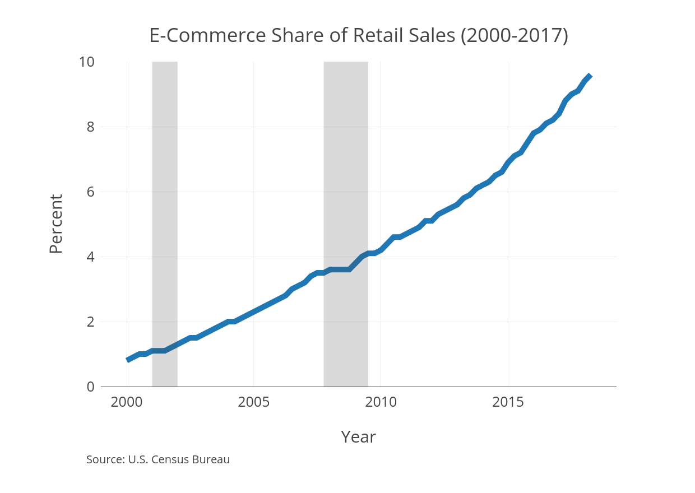
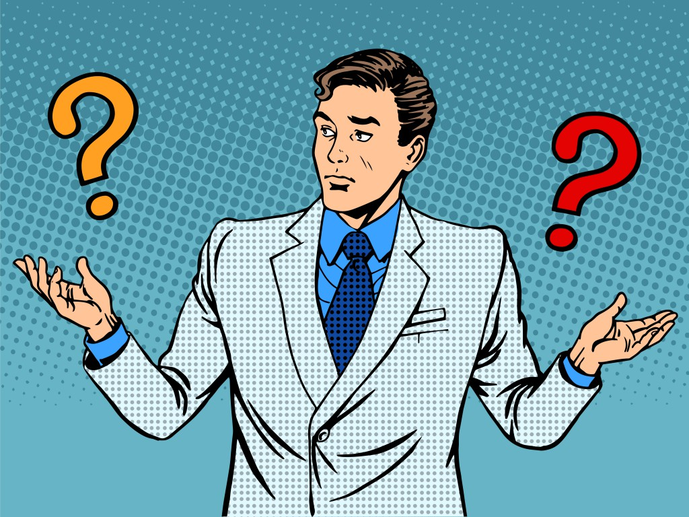

### Background

*South Dakota v. Wayfair Inc.*

### Background

\centering

### Background
> * Sales taxes makes up 33% of state tax revenue    

> * People try to avoid paying taxes when possible^\textcolor{blue}{[Citation needed]}^  

> * Online transactions have been effectively tax free  

> * Since 2008, states have started increasing enforcement of online sales tax collection

> * As of April 1, 2017, Amazon now collects sales tax in all states

### Motivating Questions
* How responsive is consumer spending to sales taxes?

    + Do consumers shift spending away from Amazon when Amazon collects sales tax in their state?
    
    + If so, where do they shift their spending?
    
* Is consumer search behavior affected by sales taxes?

### Literature
* **Cross-border Shopping:** Mikesell (1970); Asplund, Friberg, and Wilander (2007); Davis (2011); Agarwal, Marwell, and McGranahan (2017)

* **Online Shopping:** Goolsbee (2000); Alm and Melnik (2005); Scanlan (2007); Ballard and Lee (2007); Einav et al (2014); Baugh, Ben-David, and Park (2018); Houde, Newberry, and Seim (2017)

### This Paper
* Combine online shopping with cross-border shopping environments

* Estimate substitution patterns between online and offline shopping using granular browsing data

* Examine effects on consumer search

### Preview of Results
**Sales Tax Changes**

* Consumers increase search 
* Consumers reduce their offline spending, but increase their online spending by about twice the sales tax change

**Online Collection**

* Consumers reduce their pre-tax Amazon spending by about -0.4% for each percent of sales tax
* Online spending is reduced when by about 0.8% per pp of sales tax

### Preview of Results
**Offline Effects**

* Offline competition and cross-border shopping is more important to consumers
* For every 1pp difference in sales tax rate between home and adjacent county rate, online-only spending drops by about 5%

### Data

\label{toComscore}

* **comScore Web Behavior Database**

    + Granular browsing and transaction activity of ~50k households
    + Households report various demographics and ZIP code
    + Includes domain name
    + Data from 2006 to 2016 

\hyperlink{comscore}{\beamerbutton{Distribution}}
    
### Data

\label{toNielsen}

* **Nielsen Homescan Panel**

    + Nationally representative panel that keeps track of all goods that they buy and consume
    + High-quality data and well-maintained panel
    + Stores are anonymized, but they are categorized
    + Data from 2004 to 2015

\hyperlink{nielsen}{\beamerbutton{Distribution}}

* **Tax Data Systems**
    + Database of state, county, and local sales tax rates at a ZIP code level
    + Data from 2006 to 2016
    
### Regression Specification

\begin{align*}
Y^{j}_{hct} = \beta_0 + &\underbrace{\beta_1 \log(1 + SalesTax_{ct})}_{\text{Effect of Sales Tax}}
\\
\\
+ &\underbrace{\beta_2 \log(1 + SalesTax_{ct}) * \mathbbm{1}_{ct}^{Collect}}_{\text{Effect of Sales Tax After Amazon Collection}}
\\
\\
+ &\underbrace{\beta_3 TaxDiff_{ct}}_{\text{Cross-Border Shopping}}
\\
\\
+ &\underbrace{\alpha X_h + \lambda_c + \lambda_t}_{\text{Fixed Effects and Observables}} + \epsilon_{hct}
\end{align*}

### Regression Results (Expenditures)
\begin{table}[!htbp] \centering 
  \caption{Amazon Expenditures} 
  \label{} 
\resizebox{0.85\textwidth}{!}{
\begin{tabular}{@{\extracolsep{5pt}}lcccc} 
\\[-1.8ex]\hline 
\hline \\[-1.8ex] 
 & \multicolumn{4}{c}{Log Expenditures} \\ 
\cline{2-5} 
 & \multicolumn{3}{c}{All Counties} & Border Counties \\ 
\\[-1.8ex] & (1) & (2) & (3) & (4)\\ 
\hline \\[-1.8ex] 
 Log(1 + Tax) & 0.015 & 0.152 & 0.782 & $-$14.151$^{**}$ \\ 
  & (1.022) & (1.023) & (1.264) & (5.771) \\ 
  & & & & \\ 
 Log(1 + Tax) * Collect &  & $-$0.461$^{***}$ & $-$0.457$^{***}$ & $-$2.715$^{**}$ \\ 
  &  & (0.164) & (0.164) & (1.166) \\ 
  & & & & \\ 
 Tax Diff &  &  & $-$1.199 &  \\ 
  &  &  & (1.414) &  \\ 
  & & & & \\ 
\hline \\[-1.8ex] 
Observations & 156,486 & 156,486 & 156,486 & 5,386 \\ 
R$^{2}$ & 0.061 & 0.061 & 0.061 & 0.078 \\ 
Adjusted R$^{2}$ & 0.044 & 0.044 & 0.044 & 0.045 \\ 
\hline 
\hline \\[-1.8ex] 
\textit{Note:}  & \multicolumn{4}{l}{$^{*}$p$<$0.1; $^{**}$p$<$0.05; $^{***}$p$<$0.01} \\ 
 & \multicolumn{4}{l}{Household race, income, age, and presence of children as well} \\ 
 & \multicolumn{4}{l}{as month-year and county fixed effects are included.} \\ 
\end{tabular} 
}
\end{table} 

### Regression Results (Search)
\begin{table}[!htbp] \centering 
  \caption{Amazon Browsing (Minutes)} 
  \label{} 
\resizebox{0.85\textwidth}{!}{
\begin{tabular}{@{\extracolsep{5pt}}lcccc} 
\\[-1.8ex]\hline 
\hline \\[-1.8ex] 
 & \multicolumn{4}{c}{Log Minutes} \\ 
\cline{2-5} 
 & \multicolumn{3}{c}{All Counties} & Border Counties \\ 
\\[-1.8ex] & (1) & (2) & (3) & (4)\\ 
\hline \\[-1.8ex] 
 Log(1 + Tax) & $-$0.985$^{***}$ & $-$0.986$^{***}$ & $-$1.416$^{***}$ & $-$7.411$^{***}$ \\ 
  & (0.369) & (0.369) & (0.456) & (2.446) \\ 
  & & & & \\ 
 Log(1 + Tax) * Collect &  & 0.044 & 0.040 & $-$0.062 \\ 
  &  & (0.062) & (0.062) & (0.476) \\ 
  & & & & \\ 
 Tax Diff &  &  & 0.845 &  \\ 
  &  &  & (0.528) &  \\ 
  & & & & \\ 
\hline \\[-1.8ex] 
Observations & 1,543,204 & 1,543,204 & 1,543,204 & 43,792 \\ 
R$^{2}$ & 0.064 & 0.064 & 0.064 & 0.073 \\ 
Adjusted R$^{2}$ & 0.062 & 0.062 & 0.062 & 0.069 \\ 
\hline 
\hline \\[-1.8ex] 
\textit{Note:}  & \multicolumn{4}{l}{$^{*}$p$<$0.1; $^{**}$p$<$0.05; $^{***}$p$<$0.01} \\ 
 & \multicolumn{4}{l}{Household race, income, age, and presence of children as well} \\ 
 & \multicolumn{4}{l}{as month-year and county fixed effects are included.} \\ 
\end{tabular} 
}
\end{table} 

### Regression Results (Search)
\begin{table}[!htbp] \centering 
  \caption{Total Browsing (Minutes)} 
  \label{} 
\resizebox{0.85\textwidth}{!}{
\begin{tabular}{@{\extracolsep{5pt}}lcccc} 
\\[-1.8ex]\hline 
\hline \\[-1.8ex] 
 & \multicolumn{4}{c}{Log Minutes} \\ 
\cline{2-5} 
 & \multicolumn{3}{c}{All Counties} & Border Counties \\ 
\\[-1.8ex] & (1) & (2) & (3) & (4)\\ 
\hline \\[-1.8ex] 
 Log(1 + Tax) & 0.958$^{***}$ & 0.953$^{***}$ & 1.184$^{***}$ & 5.071$^{***}$ \\ 
  & (0.176) & (0.176) & (0.217) & (1.199) \\ 
  & & & & \\ 
 Log(1 + Tax) * Collect &  & 0.200$^{***}$ & 0.202$^{***}$ & $-$0.038 \\ 
  &  & (0.033) & (0.033) & (0.249) \\ 
  & & & & \\ 
 Tax Diff &  &  & $-$0.468$^{*}$ &  \\ 
  &  &  & (0.256) &  \\ 
  & & & & \\ 
\hline \\[-1.8ex] 
Observations & 8,268,270 & 8,268,270 & 8,268,270 & 219,504 \\ 
R$^{2}$ & 0.027 & 0.027 & 0.027 & 0.027 \\ 
Adjusted R$^{2}$ & 0.027 & 0.027 & 0.027 & 0.026 \\ 
\hline 
\hline \\[-1.8ex] 
\textit{Note:}  & \multicolumn{4}{l}{$^{*}$p$<$0.1; $^{**}$p$<$0.05; $^{***}$p$<$0.01} \\ 
 & \multicolumn{4}{l}{Household race, income, age, and presence of children as well} \\ 
 & \multicolumn{4}{l}{as month-year and county fixed effects are included.} \\ 
\end{tabular} 
}
\end{table} 

### Key Takeaways from comScore Data
* Amazon purchases are moderately reduced in response to sales tax collection

* Consumer search is sensitive to any change in the sales tax rate
    + Increased search when sales tax is collected online
    + Consumers search across all types of retailers

### Total Household Spending
\begin{table}[!htbp] \centering 
  \caption{Real Online Expenditures} 
  \label{} 
\resizebox{0.97\textwidth}{!}{
\begin{tabular}{@{\extracolsep{5pt}}lccccccc} 
\\[-1.8ex]\hline 
\hline \\[-1.8ex] 
 & \multicolumn{7}{c}{Log Expenditures} \\ 
\cline{2-8} 
 & \multicolumn{4}{c}{All Counties} & Post-tax & Border Counties & Post-tax \\ 
\\[-1.8ex] & (1) & (2) & (3) & (4) & (5) & (6) & (7)\\ 
\hline \\[-1.8ex] 
 Log(1 + Tax) & $-$0.933 & $-$1.115$^{*}$ & 1.875$^{**}$ & 1.867$^{**}$ & 1.909$^{**}$ & $-$0.684 & $-$0.722 \\ 
  & (0.661) & (0.661) & (0.875) & (0.875) & (0.875) & (4.546) & (4.547) \\ 
  & & & & & & & \\ 
 Log(1 + Tax) * Collect &  & $-$0.831$^{***}$ & $-$0.809$^{***}$ & $-$0.712$^{***}$ & 0.231$^{**}$ & $-$3.048$^{***}$ & $-$2.056$^{***}$ \\ 
  &  & (0.094) & (0.094) & (0.117) & (0.117) & (0.657) & (0.657) \\ 
  & & & & & & & \\ 
 Tax Diff &  &  & $-$5.106$^{***}$ & $-$5.011$^{***}$ & $-$5.020$^{***}$ &  &  \\ 
  &  &  & (0.978) & (0.980) & (0.981) &  &  \\ 
  & & & & & & & \\ 
 Tax Diff * Collect &  &  &  & $-$0.618 & $-$0.685 &  &  \\ 
  &  &  &  & (0.439) & (0.440) &  &  \\ 
  & & & & & & & \\ 
\hline \\[-1.8ex] 
Observations & 352,424 & 352,424 & 352,424 & 352,424 & 352,504 & 9,813 & 9,814 \\ 
R$^{2}$ & 0.079 & 0.079 & 0.080 & 0.080 & 0.079 & 0.095 & 0.093 \\ 
Adjusted R$^{2}$ & 0.072 & 0.072 & 0.072 & 0.072 & 0.071 & 0.078 & 0.076 \\ 
\hline 
\hline \\[-1.8ex] 
\textit{Note:}  & \multicolumn{7}{l}{$^{*}$p$<$0.1; $^{**}$p$<$0.05; $^{***}$p$<$0.01} \\ 
 & \multicolumn{7}{l}{Household race, income, and age as well as month-year and county fixed effects are included.} \\ 
\end{tabular} 
}
\end{table} 

### Total Household Spending
\begin{table}[!htbp] \centering 
  \caption{Real Offline Expenditures} 
  \label{} 
\resizebox{0.97\textwidth}{!}{
\begin{tabular}{@{\extracolsep{5pt}}lcccccc} 
\\[-1.8ex]\hline 
\hline \\[-1.8ex] 
 & \multicolumn{6}{c}{Log Expenditures} \\ 
\cline{2-7} 
 & \multicolumn{3}{c}{All Counties} & Post-tax & Non-Grocery & Border Counties \\ 
\\[-1.8ex] & (1) & (2) & (3) & (4) & (5) & (6)\\ 
\hline \\[-1.8ex] 
 Log(1 + Tax) & $-$0.692$^{***}$ & $-$0.684$^{***}$ & $-$1.142$^{***}$ & $-$0.167 & $-$0.870$^{***}$ & $-$2.376$^{***}$ \\ 
  & (0.110) & (0.111) & (0.140) & (0.140) & (0.181) & (0.744) \\ 
  & & & & & & \\ 
 Log(1 + Tax) * Collect &  & 0.064$^{***}$ & 0.061$^{***}$ & 0.061$^{***}$ & $-$0.040 & 0.057 \\ 
  &  & (0.019) & (0.019) & (0.019) & (0.025) & (0.138) \\ 
  & & & & & & \\ 
 Tax Diff &  &  & 0.877$^{***}$ & 0.909$^{***}$ & $-$0.079 &  \\ 
  &  &  & (0.164) & (0.164) & (0.212) &  \\ 
  & & & & & & \\ 
\hline \\[-1.8ex] 
Observations & 5,189,069 & 5,189,069 & 5,189,069 & 5,189,289 & 5,020,334 & 134,568 \\ 
R$^{2}$ & 0.103 & 0.103 & 0.103 & 0.101 & 0.067 & 0.106 \\ 
Adjusted R$^{2}$ & 0.102 & 0.102 & 0.102 & 0.101 & 0.066 & 0.105 \\ 
\hline 
\hline \\[-1.8ex] 
\textit{Note:}  & \multicolumn{6}{l}{$^{*}$p$<$0.1; $^{**}$p$<$0.05; $^{***}$p$<$0.01} \\ 
 & \multicolumn{6}{l}{Household race, income, and age as well as month-year and county fixed effects are included.} \\ 
\end{tabular} 
} 
\end{table} 

### Total Household Spending
\begin{table}[!htbp] \centering 
  \caption{Real Total Expenditures} 
  \label{} 
\resizebox{0.97\textwidth}{!}{
\begin{tabular}{@{\extracolsep{5pt}}lcccccc} 
\\[-1.8ex]\hline 
\hline \\[-1.8ex] 
 & \multicolumn{6}{c}{Log Expenditures} \\ 
\cline{2-7} 
 & \multicolumn{3}{c}{All Counties} & Post-tax & Non-Grocery & Border Counties \\ 
\\[-1.8ex] & (1) & (2) & (3) & (4) & (5) & (6)\\ 
\hline \\[-1.8ex] 
 Log(1 + Tax) & $-$0.632$^{***}$ & $-$0.624$^{***}$ & $-$1.036$^{***}$ & $-$0.075 & $-$0.676$^{***}$ & $-$2.506$^{***}$ \\ 
  & (0.110) & (0.110) & (0.139) & (0.139) & (0.180) & (0.739) \\ 
  & & & & & & \\ 
 Log(1 + Tax) * Collect &  & 0.060$^{***}$ & 0.058$^{***}$ & 0.073$^{***}$ & $-$0.045$^{*}$ & $-$0.001 \\ 
  &  & (0.019) & (0.019) & (0.019) & (0.025) & (0.137) \\ 
  & & & & & & \\ 
 Tax Diff &  &  & 0.789$^{***}$ & 0.822$^{***}$ & $-$0.265 &  \\ 
  &  &  & (0.163) & (0.163) & (0.211) &  \\ 
  & & & & & & \\ 
\hline \\[-1.8ex] 
Observations & 5,194,180 & 5,194,180 & 5,194,180 & 5,194,387 & 5,035,154 & 134,715 \\ 
R$^{2}$ & 0.103 & 0.103 & 0.103 & 0.101 & 0.066 & 0.106 \\ 
Adjusted R$^{2}$ & 0.102 & 0.102 & 0.102 & 0.101 & 0.066 & 0.105 \\ 
\hline 
\hline \\[-1.8ex] 
\textit{Note:}  & \multicolumn{6}{l}{$^{*}$p$<$0.1; $^{**}$p$<$0.05; $^{***}$p$<$0.01} \\ 
 & \multicolumn{6}{l}{Household race, income, and age as well as month-year and county fixed effects are included.} \\ 
\end{tabular} 
}
\end{table} 

### Summary
* Consumers avoid taxes by shopping online
    + Online spending increases in response to sales tax increases
    
* Online spending is sensitive to sales taxes
    + Amazon spending is reduced by about 0.4% per percentage point of sales tax
    + Overall online spending is reduced by about 0.8% per percentage point of sales tax
    
* Offline shopping channels are more attractive than offline options
    + Tax differences between counties counteract online spending fully
    + Border counties are more sensitive to any tax changes

### Future Research
* Explore how this informs firm decisions and competitive responses
    + How does a firm's online and offline channels interact? Are they complements are substitutes?
    + How should a traditional retail firm respond to online-only retailers? 
    + How should retailers weigh competition between online-only retailers and nearby offline competition?
    + How does the online option affect firm entry/exit decisions?

### Questions?
\centering

### Thanks!
\centering

### comScore 

\label{comscore}

### comScore

\hyperlink{toComscore}{\beamerbutton{Back}}

### Nielsen
\label{nielsen}

\hyperlink{toNielsen}{\beamerbutton{Back}}
