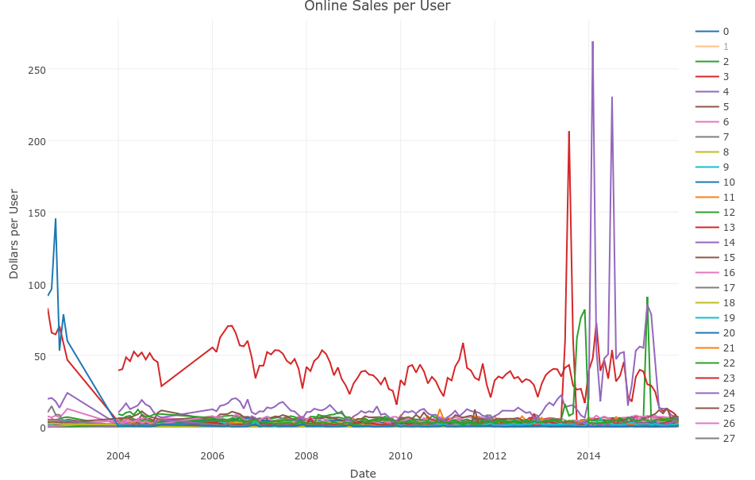
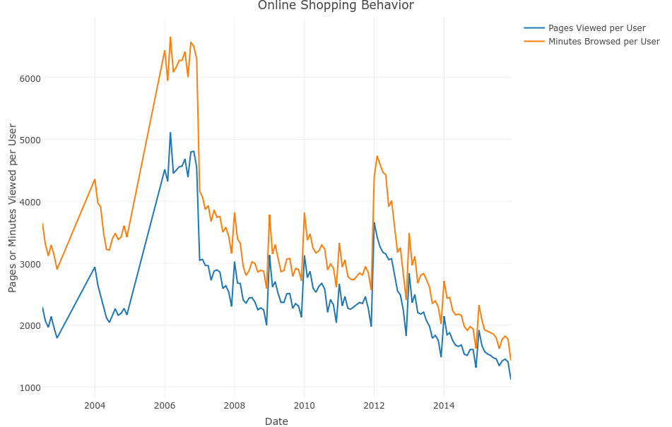
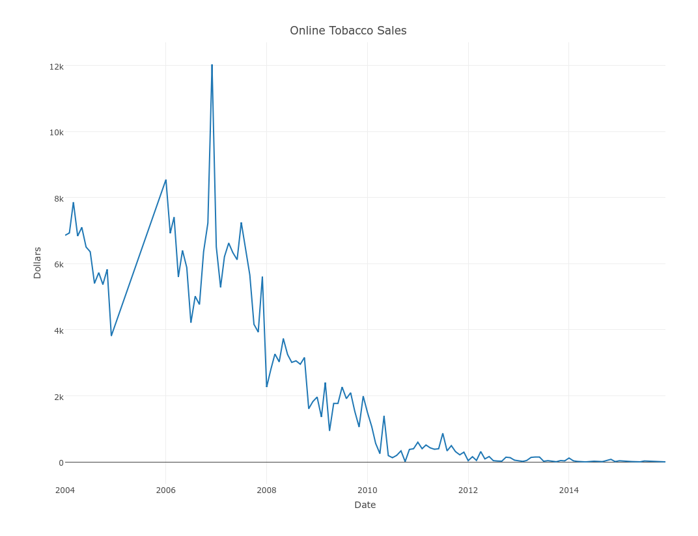
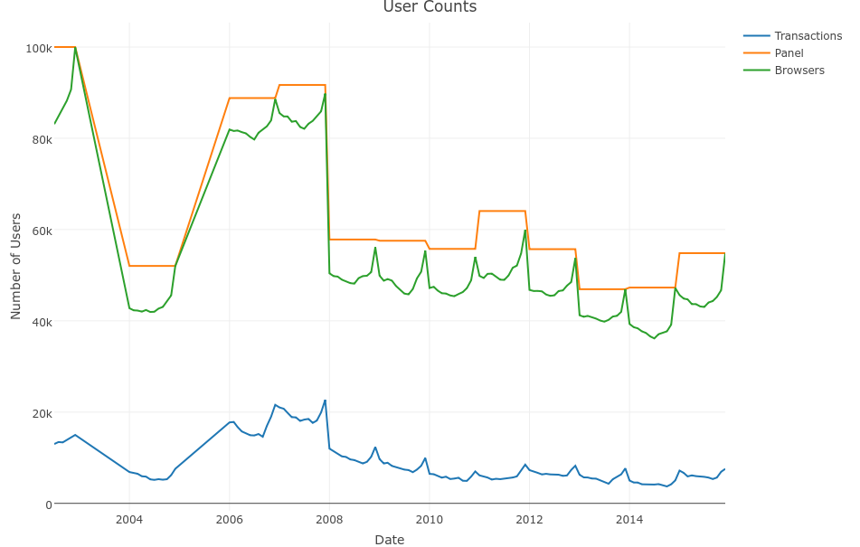
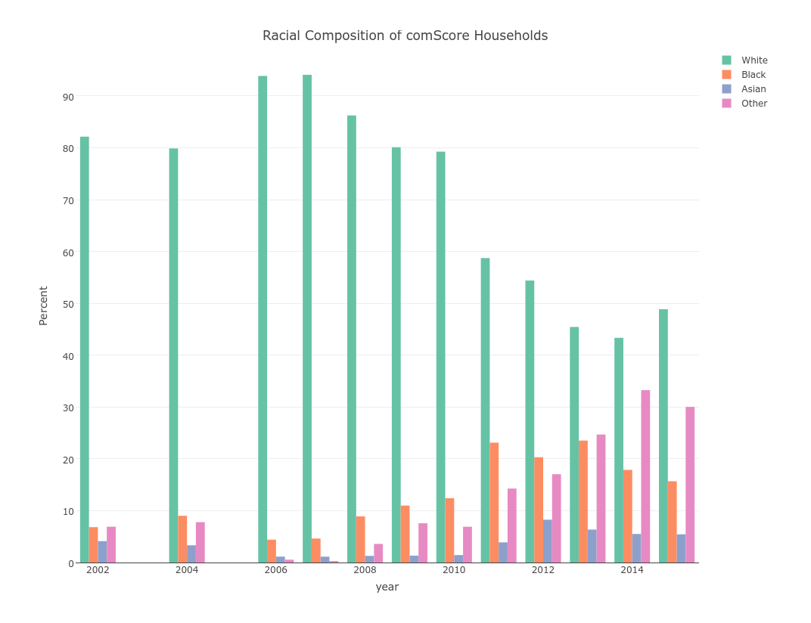
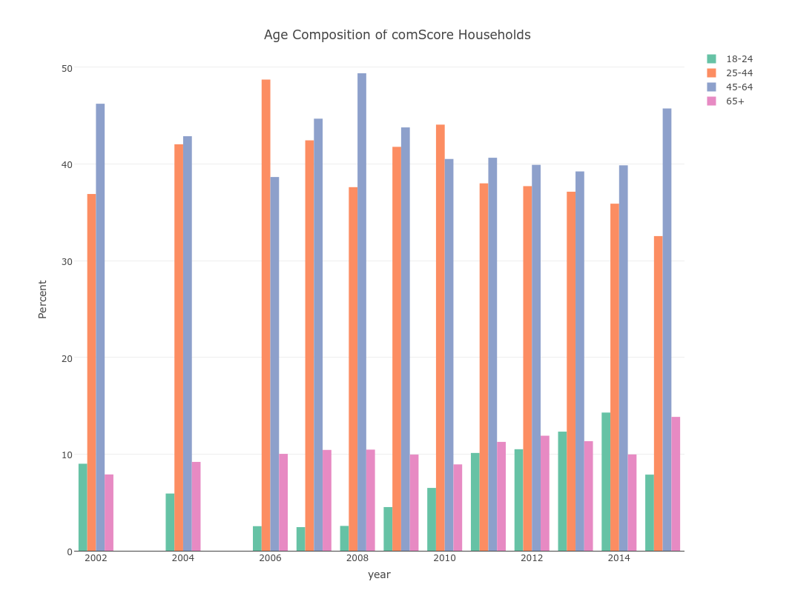
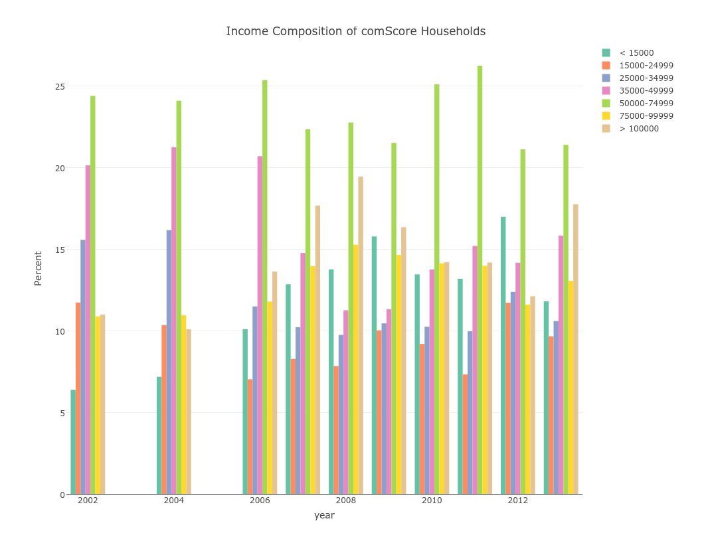

### Progress Report
* Making progress on data collection
    + Organized and began exploring comScore data
        * Turns out that it has data on all browsing. Let me know if that's helpful for future projects!
    + Borrowed ZIP-state and average sales tax data from Katja's Amazon project (I hope that's okay)
    + Obtained state-level tobacco tax and revenue data from 1970-2014 from the CDC (same data set as used in Goolsbee's analysis of internet penetration and evasion of tobacco taxes)
    + Still need to write proposal for Nielsen data (not for 3rd year paper, but for future research)
    + Made initial [tool](http://mallickhossain.com/time-use/analysis/visualization/2017/02/14/time-use-analysis/) for exploring time-use data (for future research as well)
    
### Current Goal
* Look at reduced-form relationships between tobacco taxes, reported tobacco sales, and online tobacco sales by state
    + Will provide a second-look at Goolsbee's results. 
    + His paper relied on using internet penetration to explain increased responsiveness to tobacco taxes.
    + Having actual online sales data would provide more robust analysis
    + Pairing with Nielsen data would provide a comprehensive view of online and offline tobacco purchases (and other products for future research). A common criticism is that tobacco should be treated differently than other products since it is addictive and hence tax responses may not be as informative.
* Read, summarize, and integrate more papers related to online shopping and tax responsiveness

# Sales and Browsing

### Per Capita Sales

### Browsing Behavior
* Looks like people are spending less time browsing and viewing fewer pages. Not sure how this is translating into prices.

### Online Tobacco Sale Volumes
* Online sales volumes have been falling over time. Note, this is not per capita sales just yet

# comScore Panelist Sample

### User Counts

### Race

### Race
* Compared to the 2014 racial breakdown of the US by the Census Bureau, the comScore sample is
    + Whiter, until 2010 (~80% vs 62% in Census)
    + Blacker, after 2010 (~20% vs 12% in Census)
    + Asian is relatively similar (5.2% in Census)

### Age

### Age
* Compared to the 2015 age distribution of the US, the comScore sample is more middle-aged (i.e. less 65+ and 25-44 year olds and that mass is in 45-64 year olds)

### Income

### Income
* Compared to the 2015 income distribution of the US, the comScore sample is slightly poorer
    + More making between $50k-$75k (~25% vs 17% in Census)
    + Less making over $100k (~15% vs 25% in Census)
    
### Thanks!

