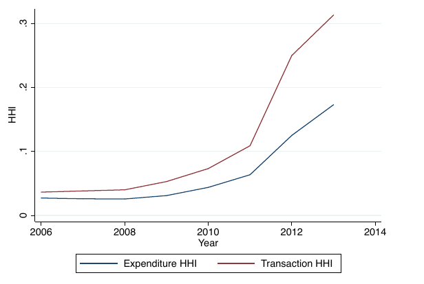

```{r, eval=TRUE, echo=FALSE, message=FALSE}
library(data.table)
library(plotly)
```


# Table 1: Expansion of fulfillment center network
There has been a flurry of activity around Amazon and state sales taxes. The number of states in which Amazon collect sales tax is up to 45, so at least the '# States with Sales Tax Liability' needs to be updated. The MWPVL information might also need to be updated since Amazon has gone on a building spree. I have the following tally from my calculations

```{r, echo=FALSE}
amazon_tally <- fread('../../AmazonSalesTaxTally.csv')
katja_tally <- data.table(Year = 2006:2018, CurrentTally = c(4, 4, 5, 5, 5, 5, 8, 16, 23, 26, 27, 28, 28))
setkey(katja_tally, Year)
amazon_tally$Year <- as.Date(amazon_tally$Year)
amazon_tally[, 'Year' := year(Year)]
setnames(amazon_tally, 'Number of states', 'Mallick Tally')
setkey(amazon_tally, Year)
full_tally <- merge(amazon_tally, katja_tally, all = TRUE)
knitr::kable(amazon_tally)
```


# Table 2: comScore Sample
I got some slightly different numbers for the comScore sample table. Generally the differences are minor. I used comScore's 'Demographics' databases to count users. The table from the paper is reproduced below:

| Year | Households | States (%) | Counties (%) |
|------|------------|------------|--------------|
| 2006 | 87,054     | 49 (100)   | 2,875 (92)   |
| 2007 | 89,952     | 49 (100)   | 2,871 (92)   |
| 2008 | 57,031     | 49 (100)   | 2,728 (87)   |
| 2009 | 55,937     | 49 (100)   | 2,664 (85)   |
| 2010 | 54,129     | 49 (100)   | 2,628 (84)   |
| 2011 | 63,363     | 49 (100)   | 2,705 (87)   |
| 2012 | 55,186     | 49 (100)   | 2,627 (84)   |
| 2013 | 46,548     | 49 (100)   | 2,436 (78)   |

## Getting Demographic Data
First, below is the code used to pull all Demographic data from the comScore database for reference
```{r, eval=FALSE, echo=TRUE}
# Vector of years to loop over
years <- c(2002, 2004, 2006:2016)
demographics <- NULL
sampleSize <- -1

# Pulling and appending all demographic data, after adding a year column
for (i in years) {
  res <- dbSendQuery(wrds, paste0('select * from COMSCORE.DEMOGRAPHICS', i))
  data <- setDT(fetch(res, n = sampleSize))
  data <- cbind(data, year = i)
  
  # Renaming column because it is named differently in earlier years
  if ('child_present' %in% colnames(data)) {
    setnames(data, 'child_present', 'children')
  }
  demographics <- rbind(demographics, data)
  rm(data)
}

# Saving
save(demographics, file = '/home/upenn/hossaine/NewComScore/Data/Demographics.rda', 
     compress = TRUE)
```

## Making Table 2
Below is the R code that generates the corresponding table as a check.
```{r}
# Loading demographics file and ZIP-to-state matching file from the Missouri Census Data Center
load(file = '/home/mallick/Desktop/comScore/Demographics.rda') # All demographic data from comScore 
zipCounty <- fread('/home/mallick/Desktop/comScore/zipState2014.csv',
                   select = c('zcta5', 'stab', 'cntyname2'), header = TRUE)

# Fixing data
zipCounty <- zipCounty[-1]  # Removing first row, which is just subheadings
zipCounty$zcta5 <- as.numeric(zipCounty$zcta5) # Converting ZIPs to numerics
zipCounty <- zipCounty[zcta5 != 99999] # Removing 99999 ZIPs which are not valid
names(zipCounty) <- c('zip_code', 'state', 'county')

# Removing cases where the ZIP matches two different counties
zipCounty <- zipCounty[!duplicated(zip_code)]

# Merging demographic data with the ZIP-to-state data (2014 ZIP codes)
setkey(demographics, zip_code)
setkey(zipCounty, zip_code)
tableData <- merge(demographics, zipCounty, all.x = TRUE)

# Getting number of states (excluding AK and HI) and counties from ZIP data
stateCount <- length(unique(zipCounty[state != 'HI' & state != 'AK']$state))
countyCount <- length(unique(zipCounty[state != 'HI' & state != 'AK']$county))

# Excluding Hawaii and Alaska and counting households, states, and counties by year
table1 <- tableData[state != 'HI' & state != 'AK', 
                    .(Households = length(unique(machine_id)), 
                      States = length(unique(state)),
                      StatePercent = length(unique(state)) / stateCount * 100,
                      Counties = length(unique(county)),
                      CountyPercent = length(unique(county)) / countyCount * 100), 
                    keyby = .(Year = year)]
knitr::kable(table1, digits = 0, col.names = c('Year', 'Households', 'States', '%', 'Counties', '%'), 
      caption = 'comScore Sample', format.args = list(big.mark = ','))
```

# Table 3: Household Purchasing
Once again, I try to recreate the table from the comScore sample. Below is Table 3 from the paper.

| Year | Online  Expenditure | Online  Transactions | % Zero Expenditure | Adjusted  Expenditure | Adjusted  Transactions |
|------|---------------------|----------------------|--------------------|-----------------------|------------------------|
| 2006 | $239                | 2.4                  | 51.8               | $240                  | 2.3                    |
| 2007 | $254                | 2.5                  | 52.0%              | $239                  | 2.3                    |
| 2008 | $196                | 2.0                  | 60.0%              | $257                  | 2.6                    |
| 2009 | $141                | 1.4                  | 67.9%              | $267                  | 2.7                    |
| 2010 | $125                | 1.4                  | 68.6%              | $274                  | 2.9                    |
| 2011 | $131                | 1.4                  | 69.7%              | $327                  | 3.4                    |
| 2012 | $151                | 1.8                  | 64.0%              | $313                  | 3.6                    |
| 2013 | $120                | 1.7                  | 65.2%              | $293                  | 4.0                    |

## Getting comScore Transaction Data
Below is the R code used to download the full comScore transaction data.

```{r eval=FALSE, echo=TRUE}
# Vector of years to loop over
years <- c(2002, 2004, 2006:2016)
transactions <- NULL
sampleSize <- -1

# Pulling and appending all domain names to the transaction data
for (i in years) {
  print(i)
  if (i == 2002) { 
    # Querying data (2002 has two data sets)
    res1 <- dbSendQuery(wrds, 'select machine_id, session_id, domain_name,
                               prod_category_id, prod_totprice, prod_name,
                               basket_tot, date_id from COMSCORE.PTRANS2002')
    data1 <- setDT(fetch(res1, n = sampleSize))
    res2 <- dbSendQuery(wrds, 'select machine_id, session_id, domain_name,
                               prod_category_id, prod_totprice, prod_name,
                               basket_tot, date_id from COMSCORE.PTRANS2_DOMAINS2')
    data2 <- setDT(fetch(res2, n = sampleSize))
    # Combining data
    data <- rbind(data1, data2)
    rm(data1, data2)
    data <- unique(data)
    setnames(data, 'date_id', 'event_date')
    setnames(data, 'session_id', 'site_session_id')
    setkey(data, domain_name)
    # Querying database to match domain_id with domain_names
    res <- dbSendQuery(wrds, paste0('select domain_id, domain_name from COMSCORE.DOMAINS', i))
    domains <- setDT(fetch(res, n = sampleSize))
    setkey(domains, domain_name)
    fullData <- merge(domains, data)
  } else {
    # Querying data
    res <- dbSendQuery(wrds, paste0('select machine_id, site_session_id, domain_id,
                                     prod_category_id, prod_totprice, prod_name, 
                                     basket_tot, event_date from COMSCORE.PTRANS', i))
    data <- setDT(fetch(res, n = sampleSize))
    data$domain_id <- as.numeric(data$domain_id)
    setkey(data, domain_id)
    # Matching domain_id with domain_names
    res <- dbSendQuery(wrds, paste0('select domain_id, domain_name from COMSCORE.DOMAINS', i))
    domains <- setDT(fetch(res, n = sampleSize))
    domains$domain_id <- as.numeric(domains$domain_id)
    setkey(domains, domain_id)
    fullData <- merge(domains, data)
  }
  # Combining all transaction data across all years
  transactions <- rbind(transactions, fullData)
  rm(data, res, domains, fullData)
}
# Doing some housekeeping on variable types and saving the full transaction file
  transactions$domain_name <- trimws(transactions$domain_name)
  transactions$prod_name <- iconv(enc2utf8(transactions$prod_name), sub = 'byte')
  transactions$prod_name <- trimws(transactions$prod_name)
  transactions$event_date <- as.Date(transactions$event_date)
  transactions[, c('year', 'month') := .(year(event_date), month(event_date))]
  save(transactions, file = '/home/upenn/hossaine/NewComScore/Data/Transactions.rda',
       compress = TRUE)
```

To get the 'adjusted' transactions and expenditures for the table, I have to get the number of weeks that each panelist was in the sample
```{r, eval=FALSE, echo=TRUE}
# This records all users and the months in which they were recorded browsing.

# Vector of years to loop over
months <- list(y2002 = 31:36, y2004 = 49:60, y2006 = 73:84, y2007 = 85:96, 
               y2008 = 97:108, y2009 = 109:120, y2010 = 121:132, y2011 = 133:144, 
               y2012 = 145:156, y2013 = 157:168, y2014 = 169:180, y2015 = 181:192,
               y2016 = 193:204)
sampleSize <- -1

# Pulling all users each month and recording the week, month, and year they were seen browsing
for (j in 1:length(months)) {
  loop <- months[[j]]
  tenure <- NULL
  for (i in loop) {
    print(i)
    if (i %in% 31:36) {
      res <- dbSendQuery(wrds, paste0("select machine_id, date_id from
                                      COMSCORE.SS", i, "M"))
      data <- setDT(fetch(res, n = sampleSize))
      setnames(data, "date_id", "event_date")
    } else {
      res <- dbSendQuery(wrds, paste0("select machine_id, event_date from
                                      COMSCORE.SS", i, "M"))
      data <- setDT(fetch(res, n = sampleSize))
    }
    data[, c("week", "year", 'event_date') :=
           .(week(event_date), year(event_date), NULL)]
    data <- unique(data)
    tenure <- rbind(tenure, data)
    rm(data, res)
  }
  # Counting the number of weeks each machine_id was observed for
  tenure <- tenure[, .(weeks = .N), keyby = machine_id]
  save(tenure, file = paste0('/home/upenn/hossaine/NewComScore/Data/PanelistTenure', 
                             names(months)[i], '.rda'), compress = TRUE)
}
```

After I have the tenure of each panelist, I can generate the above table by combining that with the transaction data. 
```{r, eval=TRUE, echo=FALSE}
# Loading transaction data on only taking expenditures in Amazon categories
load('/home/mallick/Desktop/comScore/Transactions.rda')
setkey(transactions, year)

# Getting number of households
load(file = '/home/mallick/Desktop/comScore/Demographics.rda')
total_users <- demographics[, .(total_users = length(unique(machine_id))), keyby = year]

# Merging with transactions
transactions <- merge(transactions, total_users)

# Removing products with negative or NA prices
transactions <- transactions[!is.na(prod_totprice) & prod_totprice >= 0]

# Top and bottom coding unreasonably large purchases
winsors <- quantile(transactions$prod_totprice, probs = c(0.001, 0.999))
transactions$prod_totprice <- ifelse(transactions$prod_totprice <= winsors[1], 
                                   winsors[1], transactions$prod_totprice)
transactions$prod_totprice <- ifelse(transactions$prod_totprice >= winsors[2], 
                                   winsors[2], transactions$prod_totprice)

# Restricting data to 2006 and later
transactions <- transactions[year >= 2006]
# Only getting categories that Amazon sells
amazonCategories <- c(1:40, 54:56)
transactions <- transactions[prod_category_id %in% amazonCategories]
# Totaling expenditures and counting transactions by household and by year
transactions <- transactions[, .(expenditure = sum(prod_totprice), transactions = .N, total_users = total_users), 
                             by = .(machine_id, year)]
transactions <- unique(transactions)
setkey(transactions, machine_id, year)

# Merging expenditure data with how long each panelist was in the sample to get the adjusted amount
load('/home/mallick/Desktop/comScore/PanelistTenure.rda')
setkey(full_tenure, machine_id, year)
tableData <- merge(transactions, full_tenure)
tableData[, c('AdjExp', 'AdjTrans') := .(expenditure / weeks * 52, transactions / weeks * 52)]
table2 <- tableData[, .('Online Expenditure' = mean(expenditure),
                        'Online Transactions' = mean(transactions),
                        '% Zero Expenditure' = 100 * (1 - length(unique(machine_id)) / mean(total_users)),
                        'Adjusted Expenditure' = mean(AdjExp),
                        'Adjusted Transactions' = mean(AdjTrans)), keyby = year]

knitr::kable(table2, digits = 2)
```

# Figure 1: HHI Chart
From the transaction file, I can recreate the Herfindahl-Hirshman Index chart. Below is the chart from the paper.



```{r, eval=TRUE, echo=TRUE, cache=TRUE, results='hide', warning=FALSE, fig.show=FALSE}
# Loading data and restricting the sample to 2006-2015 and only choosing product 
# categories for which at least one transaction on Amazon was recorded
load('/home/mallick/Desktop/comScore/Transactions.rda')
transactions <- transactions[year >= 2006]
amazonCategories <- c(1:40, 54:56)
transactions <- transactions[prod_category_id %in% amazonCategories]

# Removing products with negative or NA prices
transactions <- transactions[!is.na(prod_totprice) & prod_totprice >= 0]

# Top and bottom coding unreasonably large purchases
winsors <- quantile(transactions$prod_totprice, probs = c(0.001, 0.999))
transactions$prod_totprice <- ifelse(transactions$prod_totprice <= winsors[1], 
                                   winsors[1], transactions$prod_totprice)
transactions$prod_totprice <- ifelse(transactions$prod_totprice >= winsors[2], 
                                   winsors[2], transactions$prod_totprice)

# Getting total spending and number of transactions by year and by domain
shares <- transactions[, .(spending = sum(prod_totprice), count = .N), 
                       by = .(year, domain_name)]

# Getting total yearly spending and total yearly transactions
shares[, c('totalSpending', 'totalTrans') := 
         .(sum(spending), sum(count)), by = year]

# Getting expenditure shares and transaction shares by year and by domain
shares[, c('spendingShares', 'transShares') := 
         .(spending / totalSpending, count / totalTrans)]

# Squaring and summing shares to get HHI
shares[, c('spendingShares2', 'transShares2') :=
         .(spendingShares ^ 2, transShares ^ 2)]
hhIndex <- shares[, .(spending = sum(spendingShares2), trans = sum(transShares2)), by = year]

# Plotting HHI
plot_ly(data = hhIndex, x = ~year) %>%
  add_trace(y = ~spending, type = 'scatter', mode = 'lines', 
            name = 'Expenditure HHI', colors = 'blue') %>%
  add_trace(y = ~trans, type = 'scatter', mode = 'lines', 
            name = 'Transaction HHI', colors = 'red') %>%
  layout(title = 'Hirshman-Herfindahl Indices in Online Retail, 2006-2015',
         yaxis = list(title = 'HHI', range = c(0, 0.3), dtick = 0.05, 
                      titlefont = list(size = 18)),
         xaxis = list(title = 'Year', dtick = 2, titlefont = list(size = 18)),
         titlefont = list(size = 22),
         margin = list(t = 50))
export(file = './HHI.png')
```
